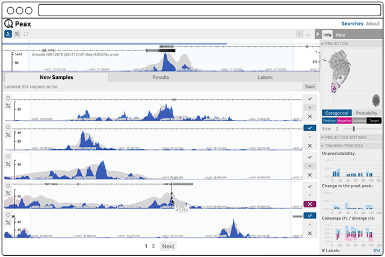

# Peax: a pattern explorer for epigenomic data



> Epigenomic data expresses a rich body of diverse patterns, but
  extracting patterns genome wide is limited, as specialized algorithms
  are required or the expressiveness is low. Peax is a tool
  for interactive concept learning and exploration of epigenomic
  patterns based on unsupervised featurization with autoencoders.
  Genomic regions are manually labeled for actively learning feature
  weights to build custom classifiers based on your notion of
  interestingness.

## Installation

```
git clone https://github.com/Novartis/peax peax && cd peax
make install
```

_Do not fear, `make install` is just a convenience function for setting up conda and installing npm packages._

**Note:** If you're a macOS user you might need to [brew](https://brew.sh) install `libpng` and `openssl` for the [pybbi](https://github.com/nvictus/pybbi) package. Also see [here](https://github.com/nvictus/pybbi/issues/2).

## Overview

Peax consists of four main parts:

1. A python module for creating a autoencoder. [[/ae](ae)]
2. A set of example notebooks exemplifying the creating of autoencoders. [[/notebooks](notebooks)]
3. A Flask-based server application for serving genomic and autoencoded data on the web. [[/server](server)].
4. A React-based user interface for exploring, visualizing, and interactively labeling genomic regions. [[/ui](ui)].

## Getting started

### Quick start

Peax comes with 2 example autoencoders for which we provide convenience scripts
to get you started as quickly as possible.

1. ChIP-seq encoder for 12Kb genomic windows at 100bp binning.

   ```
   make example-12kb
   ```

2. DNase-seq encoder for 2.4Kb genomic windows at 100bp binning

   ```
   make example-2_4kb
   ```

The convenience scripts will download test ENCODE tracks and use the matching
configuration to start the server.

_Note: if you need to run Peax on a hostname or port other than `localhost:5000` you need to [manually start Peax](#start-peax) using the respective configs which you can find in the [Makefile](Makefile)._

### Slow start

#### Build an autoencoder

_Note: right now only Keras-based autoencoders are supported._

First you need to create an autoencoder for your datasets's content types. The
design of the autoencoder is entirely up to you. To get started take a look at
the [notebooks](/notebooks) that we provide.

After creating your autoencoder save its model as an HDF5 file.

#### Configure Peax with your data

Next you need to configure Peax with your data. The main reason for doing is to tell Peax, which tracks you want to visualize in HiGlass and which of those tracks are encodable using an autoencoder.

The fastest way to get started is to copy the example config:

```
cp config.json.sample config.json
```

The main part to adjust is `aes` and `datasets`. AE stands for autoencoder and
is a list of autoencoder definitions, e.g., you could have multiple encoder for
different datatypes. The required format for autoencoders is as follows:

| Field        | Description                                                                                                                                   | Defaults | Dtype |
|--------------|-----------------------------------------------------------------------------------------------------------------------------------------------|----------|-------|
| encoder      | Relative path to your pickled encoder model. (hdf5 file)                                                                                      |          | str   |
| decoder      | Relative path to your pickled decoder model. (hdf5 file)                                                                                      |          | str   |
| content_type | Unique string describing the content this autoencoder can handle. Data tracks with the same content type will be encoded by this autoencoder. |          | str   |
| window_size  | Window size in base pairs used for training the autoencoder.                                                                                  |          | int   |
| resolution   | Resolution or bin size of the window in base pairs.                                                                                           |          | int   |
| latent_dim   | Number of latent dimensions of the encoded windows.                                                                                           |          | int   |
| input_dim    | Number of input dimensions for Keras. For 1D data these are 3: samples, data length (which is `window_size` / `resolution`), channels.        | 3        | int   |
| channels     | Number of channels of the input data. This is normally 1.                                                                                     | 1        | int   |

**Example:**

```javascript
{
  "encoder": "path/to/my-12kb-chip-seq-encoder.h5",
  "decoder": "path/to/my-12kb-chip-seq-decoder.h5",
  "content_type": "chip-seq-pval",
  "window_size": 12000,
  "resolution": 100,
  "channels": 1,
  "input_dim": 3,
  "latent_dim": 12
}
```

Datasets require the following format:

| Field        | Description                                                                                                                                                       | Dtype |
|--------------|-------------------------------------------------------------------------------------------------------------------------------------------------------------------|-------|
| filepath     | Relative path to your track data file (bigwig or bigbed).                                                                                                         | str   |
| content_type | Unique string describing the content this dataset. If you want to search for patterns in this track you need to have an autoencoder with a matching content type. | str   |
| uuid         | A unique string identifying your track. (Optional)                                                                                                                | str   |
| name         | A human readable name to be shown in HiGlass.(Optional)                                                                                                           | str   |

**Example:**

```javascript
{
  "filepath": "data/chip-seq/my-fancy-gm12878-chip-seq-h3k27c-track.bigWig",
  "content_type": "chip-seq-pval",
  "uuid": "my-fancy-gm12878-chip-seq-h3k27c-track",
  "name": "My Fancy GM12878 ChIP-Seq H3k27c Track"
}
```

#### Start Peax

Finally, start the Peax server to run the application:

```
./start.py --config=your-config.json
```

Start supports the following options:

```
usage: start.py [-h] [-e ENCODER] [-d DATASET] [-w WINDOWSIZE] [-r RESOLUTION]
                [-s STEPSIZE] [-c CHROMS] [--config CONFIG] [--clear]
                [--debug] [--host HOST] [--port PORT] [--verbose]

Peak Explorer CLI

optional arguments:
  -h, --help            show this help message and exit
  -e ENCODER, --encoder ENCODER
                        path to saved encoder
  -d DATASET, --dataset DATASET
                        path to saved dataset (bigwig)
  -w WINDOWSIZE, --windowsize WINDOWSIZE
                        path to saved dataset (bigwig)
  -r RESOLUTION, --resolution RESOLUTION
                        number of bp per bin
  -s STEPSIZE, --stepsize STEPSIZE
                        relative to window, e.g., `2` => `windowsize / 2 =
                        stepsize in bp`
  -c CHROMS, --chroms CHROMS
                        comma-separated list of chromosomes to search over
  --config CONFIG       use config file instead of args
  --clear               clears the db on startup
  --debug               debug flag
  --host HOST           Customize the hostname
  --port PORT           Customize the port
  --verbose             verbose flag
```

The `hostname` defaults to `localhost` and the `port` of the backend server defaults to `5000`.


## Development

Handy commands to keep in mind:

- `make install` installs the conda environment and npm packages and builds HiGlass
- `make update` updates the conda environment and npm packages and rebuilds HiGlass
- `make build` rebuild the peax ui
- `./start.py` starts the Flask server application for serving data
- [/ui]: `npm install` installs and updates all the needed packages for the frontend
- [/ui]: `npm build` creates the production built of the frontend
- [/ui]: `npm start` starts a dev server with hot reloading for the frontend

To start developing on the server and the ui in parallel, first start the backend server application using `./start.py` and then start the frontend server application from `./ui` using `npm start`. Both server's watch the source code, so whenever you change something the servers will reload.

### Configuration

There are 2 types of configuration files. The [backend server configuration](#configure-peax-with-your-data) defines which datasets to explore and is described in detail [above](#configure-peax-with-your-data).

Additionally, the frontend application can be configured to talk to a different backend server and port if needed. Get started by copying the example configuration:

```
cd ui && cp config.json.sample config.json
```

By default the `server` is dynamically set to the hostname of the server running the frontend application. I.e., it is assumed that the backend server application is running on the same host as the frontend application. The `port` of the server defaults to `5000`.

### Start the backend and frontend apps

For development the backend and frontend applications run as seperate server
applications.

```
# Backend server
./start.py --config=config.json --debug

# Frontend server
cd ui && npm start
```

