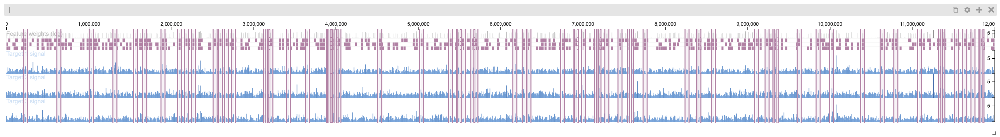

# Simulated ChIP-seq Experiment

Using [ChIPsim](https://bioconductor.org/packages/release/bioc/html/ChIPsim.html), we simulate three ChIP-seq transcription factor (TF) binding site experiments.

## Background

The goal of this simulation is to create ChIP-seq experiments with overlapping TF binding sites to generate co-located patterns that we can search for in Peax. To achieve this, we're sampling 8 features representing separate and overlapping binding sites as follow:

1. Background (no binding site)
2. Only target 1
3. Only target 2
4. Only target 3
5. Target 1 and 2
6. Target 1 and 3
7. Target 2 and 3
8. Target 1, 2, and 3

The probability for features 2-8 is 0.6%. After sampling the feature binding sites we
indipendently sample reads for each TF target. Finally, we're mapping the sampled reads
to the genome and create RPGC-normalized coverage and fold-change bigWig files.

## Usage

The following will generate the same data used in our in-person user study. It will
create a 12 Mb genome and sample 1 million reads for each of the 3 TF experiments.

```bash
chip-seq-simulation-run-for-three-targets.sh \
  --length 12000000 \
  --num 1000000 \
  --distortion distorted \
  --clear
```

## Visualization

To inspect the generated data we created [HiGlass](https://higlass.io) plots with
[higlass-python](https://github.com/higlass/higlass-python) in a [Jupyter notebook](three-targets-distorted.ipynb). The data looks like this:


